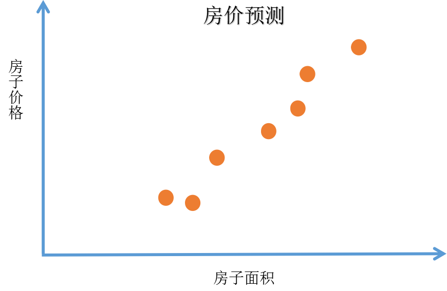

## 什么是神经网络

### 关键词解释：

深度学习：训练神经网络

---

### 举一个例子：判断房价

已知一系列房子的面积和房子的价格（如下图表）。我们想要找到一个函数，可以通过某房屋的面积来预测该房屋的价格。

按照传统的方法，我们使用线性回归来解决这个问题（比如使用最小二乘法），我们可以拟合出一条直线。得到如下图像：

我们能够发现一个问题，那就是房价不应该存在负数，那么一条直线不是一个很好的选择，我们将拟合出来的直线靠近0的时候让他弯曲，最后到达原点。如下图：

那么最终我们得到的黑色曲线就是我们需要的函数。

如果我们将这个房价预测的拟合函数看做一个非常简单的神经网络（这几乎是最简单的神经网络），我们可以进行这样理解：
有一个输入端x：房子面积（Size），
有一个输出端y：房子价格（Price），
那么：
Size→神经单元→Price

