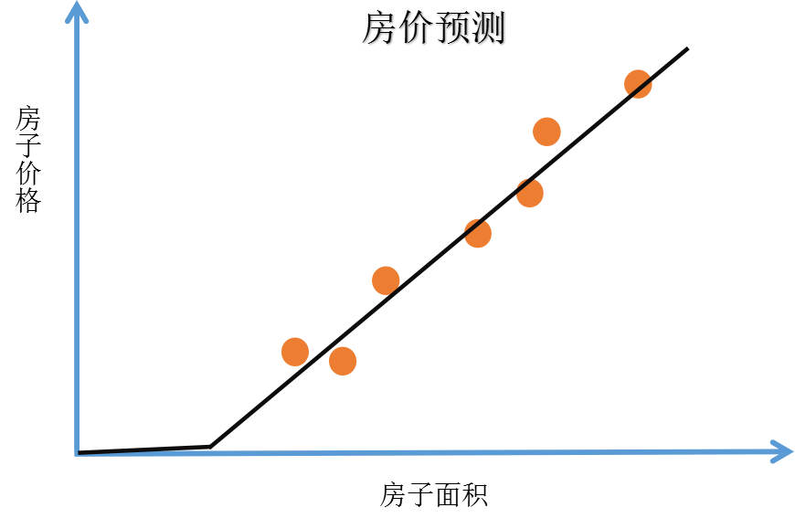

## 什么是神经网络

### 关键词解释：

深度学习：训练神经网络

ReLU（Rectified Linear Unit）函数：修正线性单元，是一类神经网络所使用的激活函数，通常是斜坡函数，且大部分是非线性的。

监督学习：利用一组已知类别的样本调整分类器的参数，使其达到所要求性能的过程，也称为监督训练或有教师学习。

---

### 举一个例子：判断房价

已知一系列房子的面积和房子的价格（如下图表）。我们想要找到一个函数，可以通过某房屋的面积来预测该房屋的价格。

按照传统的方法，我们使用线性回归来解决这个问题（比如使用最小二乘法），我们可以拟合出一条直线。得到如下图像：

我们能够发现一个问题，那就是房价不应该存在负数，那么一条直线不是一个很好的选择，我们将拟合出来的直线靠近0的时候让他弯曲，最后到达原点。如下图：

那么最终我们得到的黑色曲线就是我们需要的函数。

如果我们将这个房价预测的拟合函数看做一个非常简单的神经网络（这几乎是最简单的神经网络），我们可以进行这样理解：
有一个输入端x：房子面积（Size），
有一个输出端y：房子价格（Price），
那么：
Size→○→Price

这个○就代表着一个独立的神经元，这样我们的网络实现了上图拟合出来的函数功能。这个神经元所做的事情就是：输入面积，完成线性计算，取不小于0的值，完成房价估算。

顺便说一下，在神经网络的文献中，经常可以看到这样的函数（不一定是上述拟合出的线性的函数，也可以是非线性函数），这样的函数被称为ReUL函数。

现在我们知道上述的神经网络是简单的，小规模的。那么大型神经网络就是把很多像这样的单个神经元堆叠起来形成的。可以把这些神经元想象成一个个单独的乐高积木。构建大型神经网络就和搭积木一样。让我们看下面更复杂的例子。

## 第二个例子：更复杂的房价预测

现在我们不仅知道房子的面积，还知道房子的其他信息，比如卧室的数量。有时房子能居中的人口数量也会影响房价，人们关心房子是否能满足自己家庭的人数需求。还知道房子对应的邮编，比如邮编可以反映一些步行化程度。还有比如周围人群的富裕程度，周围学校的质量。我们可以粗略画出如下图片：

                     ###      （x）                                                                                                      （y）

在这个更复杂的例子中，最左侧的4个项是输入的内容，称为x，右侧最终的结果y就是房价。将里面的神经元堆叠起来，就形成了现在稍微大一些的神经网络。神经网络的其中一个神奇之处在于：当你实现了神经网络，你只需要输入x，就可以得到结果y，不管训练集有多大。所有的中间过程它都会自己完成。

那么实际上我们只需要做如下工作：

已知左边的输入特征，神经网络进行工作得出右侧的结果。同时我们注意到上图左边3个圆圈，被称之为“隐藏单元”，每一个输入都来自左侧4个特征。比如说：我们不会认为第一个圆圈仅仅代表家庭人口，或者说家庭人口只是取决于特征x1和特征x2。我们会说对于神经网络，神经网络自己决定这个节点是什么。我们只需输入4个特征，随便神经网络怎么计算。所以我们说左边输入层和隐藏单元这一层，在神经网络中连接数量很多，因为每个输入的特征都连接上了每个圆圈。

需要注意的是：对于神经网络来说，只有你喂给它足够多的数据，关于x和y的数据(x,y)，神经网络非常擅长计算从x到y的映射函数。

这就是一个基本的神经网络，你会发现自己的神经网络在监督学习的环境下是如此有效和强大。只需要输入x，我们就能得到y，如同预测房价的这个例子。