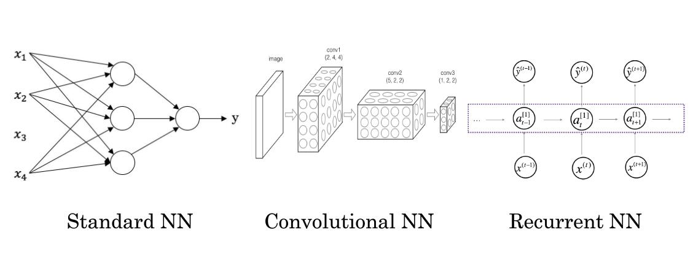

## 用神经网络进行监督学习

### 关键词解释：

监督学习：利用一组已知类别的样本调整分类器的参数，使其达到所要求性能的过程，也称为监督训练或有教师学习。

------

神经网络被媒体炒作的非常厉害，考虑到他们的使用效果，部分说法比较靠谱。事实上到目前为止，几乎所有由神经网络创造的经济价值都基于其中一种机器学习——监督学习。为了理解这个概念，我们看一下如下例子：

### 一个例子来解释监督学习

在监督学习中，输入x，习得一个函数，映射到输出y，如同在1.1章节提到的房价预测例子，还有其他例子，在这些例子中神经网络效果拔群。很可能今天通过深度学习获益最大的就是在线广告。给网站输入广告信息，网站会考虑是否给你看这个广告（特别是谷歌广告）。

已知一系列房子的面积和房子的价格（如下图表）。我们想要找到一个函数，可以通过某房屋的面积来预测该房屋的价格。或者很多在线广告公司，提供深度学习，提供让用户更容易去点击的广告。或者计算机视觉，输入图片，来识别图像包含的信息。还有语言识别功能。机器翻译也受益于深度学习。

| 输入（x）   | 输出（y）      | 应用场景 | 对应神经网络                   |
| ------- | ---------- | ---- | ------------------------ |
| 房子特征    | 房价         | 房地产  | 标准神经网络（standard nn）      |
| 广告，用户信息 | 是否点击广告     | 在线广告 | 标准神经网络（standard nn）      |
| 图片      | 对象（图片是不是猫） | 照片识别 | 卷积神经网络（convolutional nn） |
| 语言      | 文字         | 语音识别 | 循环神经网络（recurrent nn）     |
| 英语      | 汉语         | 机器翻译 |                          |

深度学习创造了那么多价值，你要机智的选择x和y，才能解决特定问题，然后把这个监督学习过的组件嵌入到更大型的系统中，比如机器翻译。

可以看成稍微不同的神经网络，运用到不同领域也行之有效，比如运用到房地产，也可以运用到在线广告，因为他们用的都是相对标准的神经网络。

在图像识别中，我们经常使用卷积神经网络。

对于序列化数据，比如音频按照时间来播放，（称为一维时间序列），我们使用循环神经网络。语言中每个文字都是按照顺序出现，所以语言最自然的表述方式也是序列数据，

对于更复杂的运用，比如无人驾驶，需要各种神经网络混合使用。

你也可能听说机器学习用于结构化数据与非结构化数据。

通常结构化数据指的是数据库里的数据，比如预测房价你有个数据库，记录每个房子的基本信息和房价。

| 面积        | 卧室数量 | 其他一些信息 | 房价   |
| --------- | ---- | ------ | ---- |
| 100 $m^2$ | 3    |        | 500万 |
| 70 $m^2$  | 2    |        | 350万 |
| 40 $m^2$  | 1    |        | 250万 |

结构化的数据的特点就是每个属性值都有明确的定义。

非结构化数据，比如：音频，图像，或者文字内容，计算机理解非结构化数据更难。但是人类很擅长处理非结构化数据。神经网络的兴起，最令人兴奋的事情之一就是，计算机处理非结构化的数据不断变强。这样就提供了很多创造丰富应用的机会。语音识别，图像识别，自然语言处理。

神经网络在很多短期经济价值的创造，是基于结构化数据的。有更好的能力去处理很多公司拥有海量数据的数据库，冰用这些数据预测未来趋势。

在这门课中，我们将学习很多技巧，可以应用到结构化数据和非结构化数据。为了更好的解释算法原理，我会多用非结构化数据的例子。但当你的团队评估各种神经网络的应用之后，希望你的神经网络可以同时学习者2种结构数据。

神经网络彻底改变了监督学习，正创造着巨大的经济价值。其实基本的神经网络背后的技术概念，大部分都不是新概念，而是几十年前就有。