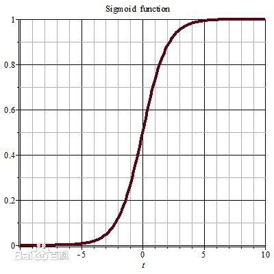
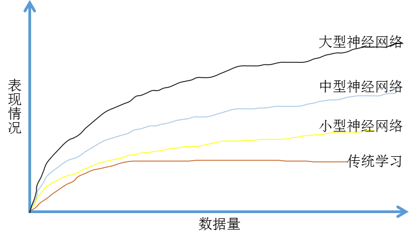
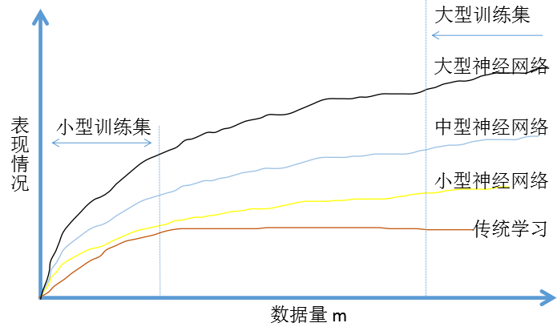
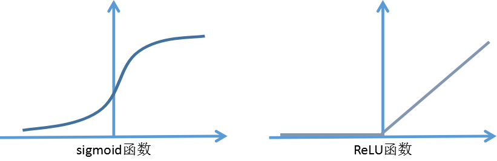

## 深度学习为何兴起

### 关键词解释：

支持向量机：在机器学习领域，是一个有监督的学习模型，通常用来进行模式识别、分类以及回归分析。

sigmoid函数：是一个在生物学中常见的S型的函数，也称为S型生长曲线。[1]  在信息科学中，由于其单增以及反函数单增等性质，Sigmoid函数常被用作神经网络的阈值函数，将变量映射到0,1之间。图像如下图所示：

梯度下降：是一个最优化算法，通常也称为最速下降法。常用于机器学习和人工智能当中用来递归性地逼近最小偏差模型。

------

如果在深度学习和神经网络的背后技术概念已经有好几十年了，为什么现在才突然流行起来？

在本节中我们来看一些让深度学习流行起来的主要因素。这会帮助你在实际工作中发现好机会来用这些东西。为什么机器学习现阶段突然变得那么厉害，我们可以先看如下图：

假设横坐标代表通过机器学习来完成某一项任务所需要的数据量，纵坐标代表这个机器学习算法完成任务的准确度。比如通过一大堆图片的学习来判断图片里面是否有猫。根据这个图像可以发现，把传统机器学习算法的表现，比如说支持向量机，或者逻辑回归，作为数据量的一个函数，你得到的曲线就是这样。一开始随着数据量增加，它的性能会大幅上升，但一段时间后它的性能进入平台期。那是因为这样的模型无法处理海量数据。

而过去20年，在社会中我们遇到的很多问题早期只有相对较少的数据量。多亏了数据化社会，现在获取海量数据相当容易。人类花了很多时间在数字王国中，在电脑，网络，移动设备上。如何数字设备上的活动都能创造数据。还有小巧的摄像机安装在手机上，还有各类传感器，我们收集了越来越多的数据。在过去的20年中，我们获取到的数据远超过传统的学习算法能发挥作用的规模。

如果使用神经网络模型的话，训练一个小型神经网络，性能会像黄线所示那样。如果是一个中型规模的神经网络，那么性能会更好。如果是大型的，性能会越来越好。

需要注意2点：

​	a）需要训练一个规模足够大的神经网络，以发挥数据规模量巨大的优点。

​	b）要达到横坐标的位置，需要大量数据

因此我们常说：规模一直在推动深度学习的进步。规模不只是神经网络的规模，还有数据的规模。要在神经网络上获得更好的表现，在今天最可靠的手段就是要么训练一个更大的神经网络，要么投入更多的数据。这只能在一定程度上起作用，因为最终会耗尽数据，或者神经网络规模太大，训练的时间太久。但是提示规模已经让我们在深度学习中获得大量进展。

为了使这个图在技术上更准确一些，在x轴上我们标出数据量。从技术上说，这是“带标签的数据”量。带标签的数据，在训练样本时，我们有输入x和标签y。

图中还有很多细节。如下图：

在训练集数量不大的情况下，各种算法性能的相对排名不是很确定，效果取决于人手工设计的组件。很可能比如有人训练出一个支持向量机（SVM），很可能因为设计的非常好，在数据量不大的情况下SVM表现的更好。因此在图中左侧区域，各类算法的性能排名不是很明确。只有在大数据领域，在图中右边，数据量庞大的情况下，我们才能见到神经网络稳定的领先于其他算法。

### 规模驱使着深度学习的发展

在深度学习崛起的初期，是数据和计算能力规模的进展，训练一个特别大的神经网络的能力，无论是在CPU还是GPU上，是这些发展使我们获得巨大的进步。但是渐渐地，尤其在近几年，我们也见证了算法上面的极大创新，有趣的是，许多算法上的创新都是为了让神经网络运行的更快。举个例子：神经网络方面一个巨大的突破是从sigmoid函数转换到这样的ReLU函数。

使用sigmoid函数，机器学习问题是在两侧区域，sigmoid函数的斜率接近与0，所以学习会变得非常缓慢，因为用梯度下降法，梯度接近于0时参数会变化的很慢，学习也会变得很慢。而通过改变激活函数，梯度不会趋于0。而右侧函数的斜率在左侧是0，但是右侧不是。因此我们只需将sigmoid函数转换成ReLU函数，就能使梯度下降法运行得更快。这就是一个有点简单的算法创新例子。但是最终算法创新带来的影响是增加计算速度。这也使得我们可以训练规模更大的神经网络。或者在合理的时间内完成计算，即便在数据量很大，神经网络很大的情况下。

快速计算很重要的另一个原因是训练神经网络的过程很多时候是凭直觉的。你有了新的关于神经网络架构的想法，然后写代码实现，然后运行一下进行试验，可以告诉你你的神经网络效果有多好。知道结果后在回去改神经网络中的一些细节。你不断重复这个循环。当你的神经网络需要很长时间去训练，就需要很长时间走一圈循环。在实现神经网络时，迭代速度对你的效率影响非常大。

如果你有一个想法直接去试，10分钟后就可以看到结果，或者花费1天。如果训练神经网络花了1个月的时间（有时确实需要这么长时间），如果你能快速得到结果，你就可以尝试更多的想法。你就可以发现适合你的应用的神经网络。

所以计算速度的提升有助于提高迭代速度，让你快速得到结果。也同时帮助了神经网络的从业人员和有关项目研究人员在深度学习过程中迭代更快。所有这些都极大的推动了整个深度学习社区的研究，快到让人难以置信。

人们一直在发明新的算法，取得不断进步，这些力量支持了深度学习的崛起。好消息是这些力量还在不断发挥作用，让深度学习更进一步。在数据上，我们的社会还在不断产生数字化数据。在计算上，GPU这类硬件设备还在发展。网络速度更快，硬件速度更快，我们有信心实现超级大规模神经网络。