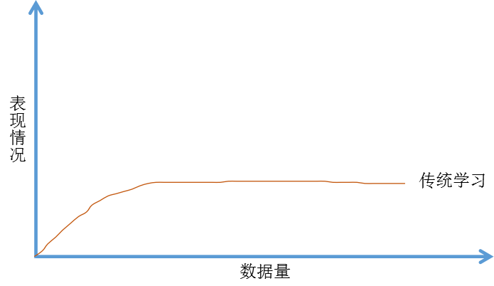

## 深度学习为何兴起

### 关键词解释：

监督学习：利用一组已知类别的样本调整分类器的参数，使其达到所要求性能的过程，也称为监督训练或有教师学习。

------

如果在深度学习和神经网络的背后技术概念已经有好几十年了，为什么现在才突然流行起来？

在本节中我们来看一些让深度学习流行起来的主要因素。这会帮助你在实际工作中发现好机会来用这些东西。为什么机器学习现阶段突然变得那么厉害，我们可以先看如下图：

假设横坐标代表通过机器学习来完成某一项任务所需要的数据量，纵坐标代表这个机器学习算法完成任务的准确度。比如通过一大堆图片的学习来判断图片里面是否有猫。根据这个图像可以发现，把传统机器学习算法的表现，比如说支持向量机，或者逻辑回归，作为数据量的一个函数，你得到的曲线就是这样。一开始随着数据量增加，它的性能会大幅上升，但一段时间后它的性能进入平台期。那是因为这样的模型无法处理海量数据。

而过去20年，在社会中我们遇到的很多问题早期只有相对较少的数据量。多亏了数据化社会，现在获取海量数据相当容易。人类花了很多时间在数字王国中，在电脑，网络，移动设备上。如何数字设备上的活动都能创造数据。还有小巧的摄像机安装在手机上，还有各类传感器，我们收集了越来越多的数据。在过去的20年中，我们获取到的数据远超过传统的学习算法能发挥作用的规模。