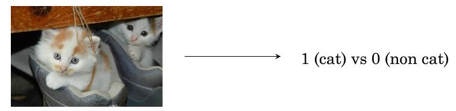
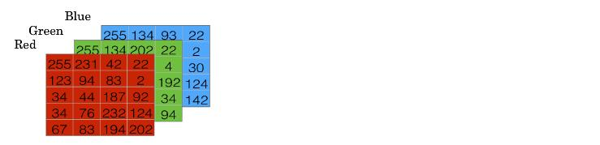

## 二分分类

### 关键词解释：

深度学习：训练神经网络

ReLU（Rectified Linear Unit）函数：修正线性单元，是一类神经网络所使用的激活函数，通常是斜坡函数，且大部分是非线性的。

监督学习：利用一组已知类别的样本调整分类器的参数，使其达到所要求性能的过程，也称为监督训练或有教师学习。

---

当你要构造神经网络，有些技巧相当重要。比如m个样本的训练集，你可能习惯性用for循环来遍历m个样本。但是实现一个神经网络，如果要遍历整个训练集，不需要直接使用for循环。其次神经网络的计算过程中，通常有个正向传播步骤，还有反向传播步骤。

logistic回归是一种用于二分分类的算法。我们从一个问题开始。

### 二分分类例子

比如你有一张图片作为输入，你想输出识别此图的标签，如果是猫，输出1，不是则输出0。我们用y表示输出的结果标签。来看下图计算机是如何处理的。

计算机保存一张图片，要保存3个独立的矩阵，分别对应红，绿，蓝三个通道。假设输入的图片是$64*64$ 尺寸，那么就有3个$64*64$ 的矩阵，来对应图片3中颜色像素的亮度。为了方便表示，我们用小一些的矩阵，用$5*4$ 的矩阵。要把这些像素值的颜色值提取出来放进一个特征向量x。
$$
x= \left[
 \begin{matrix}
   255\\
   231\\
   ...\\
   202\\
   255\\
   134\\
   ...\\
   94\\
   255\\
   134\\
   ...\\
   142
  \end{matrix}
  \right]
$$
我们先将红色的像素值写进一个特征向量中，然后是绿色，蓝色都写进x里。如果图像是$64*64$ 尺寸，那么x的总维度是$64*64*3=12288$ 。然后我们用$n_x=12288$ 来表示输入的特征向量的维度。

在二分分类问题中，目标是训练出一个分类器，它以图片的特征向量x作为输入，预测输出结果y是0还是1。我们用$X=[x^{(1)},x^{(2)},x^{(3)},...,x^{(m)}]$ 表示一个$n_x*m$ 的矩阵。在Python中，我们会看到X.shape，只是一条Python指令，用来输出矩阵的维度，即$(n_x,m)$ 。这就是用矩阵表示输入x，那么输出y怎么表示？同样，为了方便起见，构建神经网络，将y也放到列中：$Y=[y^{(1)},y^{(2)},y^{(3)},...,y^{(m)}]$ ，在Python中，矩阵维度Y.shape就是$(1,m)$ 。

在后续的课程中会发现好的符号约定可以将不同训练样本的数据联系起来。这里说的数据将不只有x和y，之后还会有其他的量。将不同的训练样本数据取出来放到不同的列。

